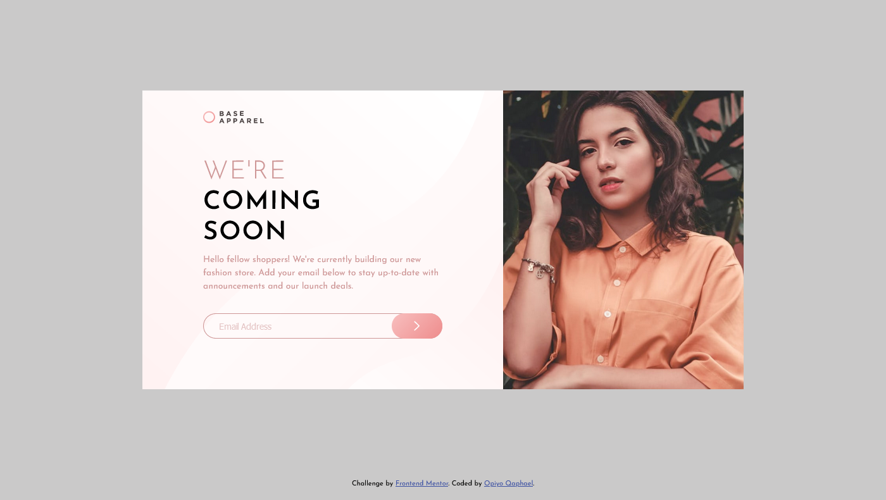
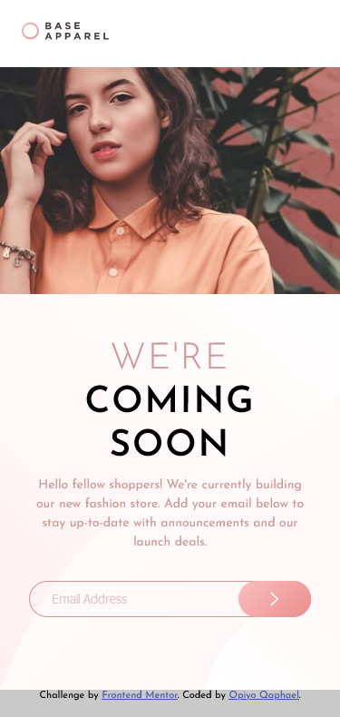

# Frontend Mentor - Base Apparel coming soon page solution

This is a solution to the [Base Apparel coming soon page challenge on Frontend Mentor](https://www.frontendmentor.io/challenges/base-apparel-coming-soon-page-5d46b47f8db8a7063f9331a0). Frontend Mentor challenges help you improve your coding skills by building realistic projects.

## Table of contents

-   [Overview](#overview)
  - [The challenge](#the-challenge)
  - [Screenshot](#screenshot)
  - [Links](#links)
  - [Built with](#built-with)
  - [What I learned](#what-i-learned)
  - [Useful resources](#useful-resources)
  - [Author](#author)


## Overview
This is the front end mentor challenge recreation of "Base Apparel coming soon page" solution I did following my other frontend mentor code challenges

### The challenge

Users should be able to:

- View the optimal layout for the site depending on their device's screen size
- See hover states for all interactive elements on the page
- Receive an error message when the `form` is submitted if:
- The `input` field is empty
- The email address is not formatted correctly

### Screenshot




### Links

- Solution URL: [https://github.com/Qaphael/base-apparel-coming-soon](https://github.com/Qaphael/base-apparel-coming-soon)
- Live Site URL: [https://qaphael.github.io/base-apparel-coming-soon/](https://qaphael.github.io/base-apparel-coming-soon/)

## My process

### Built with

- Semantic HTML5 markup
- CSS custom properties
- Flexbox
- CSS Grid
- vscode

### What I learned

I learned and practiced a great deal of flex property in this challenge for positioning

### Code Snippets I'm proud of

```html
<div class="input-wrapper">
  <div>
    <input class="input common" type="text" placeholder="Email Address">
      
  </div>
  <button class="btn common">
    
  </button>
  <p class="error-text">Please provide a valid email</p>
</div>
```
```css
.btn {
    position: absolute;
    top: 0;
    right: 0;
    width: 5rem;
    background-image: linear-gradient( 135deg, hsl(0, 80%, 86%), hsl(0, 74%, 74%));
    border: 0;
    display: flex;
    align-items: center;
    justify-content: center;
    transition: all .3s ease;
    cursor: pointer;
}

.btn:hover {
    box-shadow: 0 10px 15px 0px rgba(206, 151, 151, 0.8);
}
```
```js
function ValidateEmail() {
  var mailformat = /^\w+([\.-]?\w+)*@\w+([\.-]?\w+)*(\.\w{2,3})+$/;
  if (inputField.value.match(mailformat)) {
    console.log("done validating");
    errorIcon.classList.remove("active");
    errorText.classList.remove("active");
  } else {
    console.log("not validated");
    errorIcon.classList.add("active");
    errorText.classList.add("active");
  }
}
```

### Useful resources

- [google fonts](https://fonts.google.com/) - This helped me for fonts i used in this challenge.

## Author

- Website - [Qaphael Opiyo](https://qaphael-portfolio-website.web.app/)
- Frontend Mentor - [@yourusername](https://www.frontendmentor.io/profile/Qaphael)
- Twitter - [@laflo_lr](https://twitter.com/Laflo_lr)
- Github - [@Qaphael](https://github.com/Qaphael)

